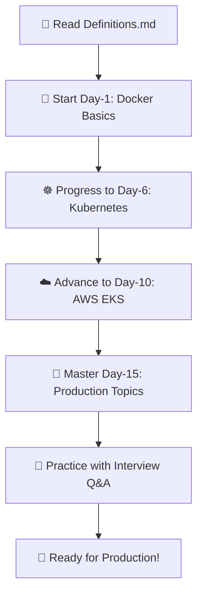

# 🐳☸️ Docker & Kubernetes Training Repository

<div align="center">


**A comprehensive 18-day training program covering Docker and Kubernetes fundamentals through advanced production concepts**

[](https://github.com/saicharankarasala/Docker-Kubernetes-Training)
[](https://github.com/saicharankarasala/Docker-Kubernetes-Training)
[](https://github.com/saicharankarasala/Docker-Kubernetes-Training/issues)

</div>

---

## 📋 Table of Contents

| Section | Description |
|---------|-------------|
| [🎯 About](#-about-this-repository) | Repository overview and learning objectives |
| [🚀 Learning Path](#-learning-path--structure) | Structured 4-phase training program |
| [📚 Prerequisites](#-prerequisites) | Required knowledge and tools |
| [⚡ Quick Start](#-quick-start-guide) | Get started in minutes |
| [📖 Daily Modules](#-daily-training-modules) | Detailed breakdown of all 18 days |
| [🛠️ Resources](#-additional-resources) | Documentation, scripts, and tools |
| [💼 Interview Prep](#-interview-preparation) | Q&A for job readiness |
| [🤝 Contributing](#-contributing) | How to contribute to this project |

---

## 🎯 About This Repository

This repository contains a **comprehensive 18-day training program** designed to take you from Docker basics to advanced Kubernetes production scenarios. Whether you're a beginner or looking to enhance your container orchestration skills, this structured learning path provides hands-on experience with real-world applications.

### 🎓 Learning Objectives

| **Phase** | **Focus Area** | **Skills Gained** |
|-----------|----------------|-------------------|
| **Phase 1** | Docker Fundamentals | Containerization, networking, storage |
| **Phase 2** | Kubernetes Core | Pods, services, configuration management |
| **Phase 3** | AWS EKS Integration | Cloud-native deployments, IAM, storage |
| **Phase 4** | Production & Advanced | Auto-scaling, ingress, database integration |

### 🏗️ Repository Structure

```
Docker-Kubernetes-Training/
├── 📁 Day-1/                    # Docker Introduction & Basics
├── 📁 Day-2/                    # Docker Commands & Images
├── 📁 Day-3/                    # Docker Networking & Volumes
├── 📁 Day-4/                    # Multi-container Applications
├── 📁 Day-5/                    # Docker Best Practices
├── 📁 Day-6/                    # Kubernetes Fundamentals
├── 📁 Day-7/                    # ReplicaSets & Auto-healing
├── 📁 Day-8/                    # Services & Networking
├── 📁 Day-9/                    # ConfigMaps & Secrets
├── 📁 Day-10/                   # AWS EKS Introduction
├── 📁 Day-11/                   # Namespaces & Context
├── 📁 Day-12/                   # EKS Pod Identity
├── 📁 Day-13/                   # Persistent Storage (PV/PVC)
├── 📁 Day-14/                   # EBS CSI Driver
├── 📁 Day-15/                   # EKS Storage with RDS Database
├── 📁 Day-16/                   # Advanced Applications
├── 📁 Day-17/                   # Ingress & Annotations
├── 📁 Day-18/                   # Horizontal Pod Autoscaler (HPA)
├── 📁 Docker-Interview-Q&A/      # Docker interview questions
├── 📁 Kubernetes-Interview-Q&A/ # Kubernetes interview questions
├── 📄 iam_policy.json           # AWS IAM policies
└── 📄 Definitions.md            # Comprehensive term definitions
```

---

## 🚀 Learning Path & Structure

### **Phase 1: Docker Fundamentals** 🐳
*Days 1-5: Master containerization basics*

| Day | Topic | Key Concepts | Duration |
|-----|-------|--------------|----------|
| **Day 1** | Docker Introduction | Containers vs VMs, Docker basics | 2-3 hours |
| **Day 2** | Commands & Images | docker run, build, push, pull | 3-4 hours |
| **Day 3** | Networking & Volumes | Bridge networks, named volumes | 3-4 hours |
| **Day 4** | Multi-container Apps | Docker Compose, service communication | 4-5 hours |
| **Day 5** | Best Practices | Image optimization, security | 2-3 hours |

### **Phase 2: Kubernetes Core** ☸️
*Days 6-9: Learn container orchestration*

| Day | Topic | Key Concepts | Duration |
|-----|-------|--------------|----------|
| **Day 6** | K8s Fundamentals | Pods, Deployments, ReplicaSets | 4-5 hours |
| **Day 7** | Auto-healing | Controllers, YAML structure | 3-4 hours |
| **Day 8** | Services | ClusterIP, NodePort, LoadBalancer | 4-5 hours |
| **Day 9** | Configuration | ConfigMaps, Secrets, env vars | 3-4 hours |

### **Phase 3: AWS EKS Integration** ☁️
*Days 10-14: Cloud-native deployments*

| Day | Topic | Key Concepts | Duration |
|-----|-------|--------------|----------|
| **Day 10** | EKS Introduction | Managed K8s, cluster creation | 4-5 hours |
| **Day 11** | Namespaces & Context | Multi-environment, RBAC | 3-4 hours |
| **Day 12** | Pod Identity | IAM roles, service accounts | 4-5 hours |
| **Day 13** | Persistent Storage | PV, PVC, EBS integration | 4-5 hours |
| **Day 14** | CSI Driver | Dynamic provisioning, gp3 volumes | 3-4 hours |

### **Phase 4: Production & Advanced** 🚀
*Days 15-18: Production-ready scenarios*

| Day | Topic | Key Concepts | Duration |
|-----|-------|--------------|----------|
| **Day 15** | RDS Integration | External databases, MySQL service | 4-5 hours |
| **Day 16** | Advanced Apps | Multi-service applications | 4-5 hours |
| **Day 17** | Ingress & Annotations | Load balancing, routing | 4-5 hours |
| **Day 18** | Auto-scaling | HPA, performance monitoring | 3-4 hours |

---

## 📚 Prerequisites

### **Required Knowledge** 📖

| Skill Level | Requirements |
|-------------|--------------|
| **Beginner** | Basic Linux command line, YAML syntax |
| **Intermediate** | Networking concepts, cloud basics |
| **Advanced** | Previous container experience helpful |

### **Required Tools** 🛠️

| Tool | Purpose | Installation |
|------|---------|--------------|
| **Docker Desktop** | Local container development | [Download](https://www.docker.com/products/docker-desktop) |
| **kubectl** | Kubernetes command-line tool | [Install Guide](https://kubernetes.io/docs/tasks/tools/) |
| **AWS CLI** | AWS service management | [Install Guide](https://docs.aws.amazon.com/cli/latest/userguide/getting-started-install.html) |
| **eksctl** | EKS cluster management | [Install Guide](https://eksctl.io/introduction/installation/) |
| **Minikube** | Local Kubernetes testing | [Install Guide](https://minikube.sigs.k8s.io/docs/start/) |

### **Installation Commands** 💻

```bash
# Install kubectl (macOS)
curl -LO "https://dl.k8s.io/release/$(curl -L -s https://dl.k8s.io/release/stable.txt)/bin/darwin/amd64/kubectl"
sudo install -o root -g wheel -m 0755 kubectl /usr/local/bin/kubectl

# Install eksctl (macOS)
curl --silent --location "https://github.com/weaveworks/eksctl/releases/latest/download/eksctl_$(uname -s)_amd64.tar.gz" | tar xz -C /tmp
sudo mv /tmp/eksctl /usr/local/bin

# Install Minikube (macOS)
curl -LO https://storage.googleapis.com/minikube/releases/latest/minikube-darwin-amd64
sudo install minikube-darwin-amd64 /usr/local/bin/minikube
```

---

## ⚡ Quick Start Guide

### **1. Clone the Repository** 📥

```bash
git clone https://github.com/saicharankarasala/Docker-Kubernetes-Training.git
cd Docker-Kubernetes-Training
```

### **2. Start with Docker Basics** 🐳

```bash
# Navigate to Day 2 project
cd Day-2/python-application/snake-game

# Build and run the Snake Game
docker build -t snake-game .
docker run -p 5000:5000 snake-game

# Open browser: http://localhost:5000
```

### **3. Set up Local Kubernetes** ☸️

```bash
# Start Minikube
minikube start --driver=docker

# Verify cluster
kubectl get nodes

# Check cluster info
kubectl cluster-info
```

### **4. Explore Training Materials** 📚

```bash
# Start with Day 1
open Day-1/README.md

# Reference definitions
open Definitions.md

# Practice with interview questions
open Docker-Interview-Q&A/README.md
```

---

## 📖 Daily Training Modules

### **🐳 Docker Phase (Days 1-5)**

<details>
<summary><strong>Day 1: Docker Introduction</strong></summary>

- **Concepts**: Containers vs VMs, Docker architecture
- **Hands-on**: Snake Game setup and containerization
- **Duration**: 2-3 hours
- **Prerequisites**: Basic Linux knowledge

</details>

<details>
<summary><strong>Day 2: Docker Commands & Images</strong></summary>

- **Concepts**: docker run, build, push, pull, Dockerfile instructions
- **Hands-on**: Python Flask app containerization
- **Duration**: 3-4 hours
- **Key Files**: `docker-commands/README.md`, `docker-images/README.md`

</details>

<details>
<summary><strong>Day 3: Docker Networking & Volumes</strong></summary>

- **Concepts**: Bridge networks, named volumes, bind mounts, multi-stage builds
- **Hands-on**: Multi-stage Dockerfile optimization
- **Duration**: 3-4 hours
- **Key Files**: `docker-networking/README.md`, `docker-volumes/README.md`

</details>

<details>
<summary><strong>Day 4: Multi-container Applications</strong></summary>

- **Concepts**: Docker Compose, service communication
- **Hands-on**: Voting app deployment
- **Duration**: 4-5 hours
- **Key Files**: `docker-network-demo/`, `example-voting-app/`

</details>

<details>
<summary><strong>Day 5: Docker Best Practices</strong></summary>

- **Concepts**: Image optimization, security, picking base images
- **Hands-on**: Production-ready Dockerfile
- **Duration**: 2-3 hours
- **Key Files**: `picking-base-image/README.md`

</details>

### **☸️ Kubernetes Phase (Days 6-9)**

<details>
<summary><strong>Day 6: Kubernetes Fundamentals</strong></summary>

- **Concepts**: Pods, Deployments, ReplicaSets, Minikube setup
- **Hands-on**: Basic pod deployment
- **Duration**: 4-5 hours
- **Key Files**: `kubernetes-objects/`, `pod-notes/README.md`

</details>

<details>
<summary><strong>Day 7: Auto-healing & YAML</strong></summary>

- **Concepts**: Controllers, YAML structure, ReplicaSet management
- **Hands-on**: ReplicaSet auto-healing demo
- **Duration**: 3-4 hours
- **Key Files**: `Replicaset-Auto-Healing/README.md`, `YAML-Basics/README.md`

</details>

<details>
<summary><strong>Day 8: Services & Networking</strong></summary>

- **Concepts**: ClusterIP, NodePort, LoadBalancer services
- **Hands-on**: Service networking and port mapping
- **Duration**: 4-5 hours
- **Key Files**: `kubernetes-objects/`, `Services-Notes/README.md`

</details>

<details>
<summary><strong>Day 9: Configuration Management</strong></summary>

- **Concepts**: ConfigMaps, Secrets, environment variables
- **Hands-on**: Weather dashboard app with config management
- **Duration**: 3-4 hours
- **Key Files**: `demo-applicatiom/`, `Notes/README.md`

</details>

### **☁️ AWS EKS Phase (Days 10-14)**

<details>
<summary><strong>Day 10: EKS Introduction</strong></summary>

- **Concepts**: Managed K8s, cluster creation, EKS pricing
- **Hands-on**: EKS cluster setup
- **Duration**: 4-5 hours
- **Key Files**: `eks-cluster-creation/README.md`, `eks-pricing/README.md`

</details>

<details>
<summary><strong>Day 11: Namespaces & Context</strong></summary>

- **Concepts**: Multi-environment, RBAC, context switching
- **Hands-on**: Namespace isolation and management
- **Duration**: 3-4 hours
- **Key Files**: `Namespaces/README.md`, `frontend-backend-namespace-example/`

</details>

<details>
<summary><strong>Day 12: EKS Pod Identity</strong></summary>

- **Concepts**: IAM roles, service accounts, Pod Identity Agent
- **Hands-on**: S3 access from pods
- **Duration**: 4-5 hours
- **Key Files**: `EKS-Pod-Identity-Agent/README.md`, `eks-scripts/`

</details>

<details>
<summary><strong>Day 13: Persistent Storage</strong></summary>

- **Concepts**: PV, PVC, EBS integration, storage classes
- **Hands-on**: Database with persistent storage
- **Duration**: 4-5 hours
- **Key Files**: `eks-pv-pvc-demo/`, `PV-PVC-Notes/README.md`

</details>

<details>
<summary><strong>Day 14: EBS CSI Driver</strong></summary>

- **Concepts**: Dynamic provisioning, gp3 volumes, CSI drivers
- **Hands-on**: Production storage setup
- **Duration**: 3-4 hours
- **Key Files**: `pod.yaml`, `pvc.yaml`, `storageclass.yaml`

</details>

### **🚀 Production & Advanced Phase (Days 15-18)**

<details>
<summary><strong>Day 15: RDS Integration</strong></summary>

- **Concepts**: External databases, MySQL service, VPC, Security Groups
- **Hands-on**: User management with RDS
- **Duration**: 4-5 hours
- **Key Files**: `06-EKS-Storage-with-RDS-Database/README.md`, `Notes/README.md`

</details>

<details>
<summary><strong>Day 16: Advanced Applications</strong></summary>

- **Concepts**: Multi-service applications, service types
- **Hands-on**: Ball App & Snake App with multiple services
- **Duration**: 4-5 hours
- **Key Files**: `ball-app/`, `snake-app/`, `Notes/README.md`

</details>

<details>
<summary><strong>Day 17: Ingress & Annotations</strong></summary>

- **Concepts**: Load balancing, routing, ALB annotations
- **Hands-on**: Ingress controller setup
- **Duration**: 4-5 hours
- **Key Files**: `ingress.yaml`, `Annotation-Notes/README.md`

</details>

<details>
<summary><strong>Day 18: Auto-scaling</strong></summary>

- **Concepts**: HPA, performance monitoring, metrics server
- **Hands-on**: Auto-scaling demo
- **Duration**: 3-4 hours
- **Key Files**: `hpa-demo.yaml`, `HPA.pdf`

</details>

---

## 🛠️ Additional Resources

### **📚 Documentation**

| Resource | Description | Link |
|----------|-------------|------|
| **Definitions.md** | 150+ comprehensive term definitions | [📖 View](./Definitions.md) |
| **Daily README files** | Detailed explanations for each module | [📁 Browse](./Day-1/) |
| **YAML examples** | Production-ready Kubernetes manifests | [📄 Examples](./Day-6/kubernetes-objects/) |
| **Scripts** | Automation for EKS cluster management | [🔧 Scripts](./Day-12/eks-scripts/) |

### **🎯 Hands-on Projects**

| Project | Day | Technologies | Description |
|---------|-----|--------------|-------------|
| **Snake Game** | Day 2 | Python, Flask | Interactive web game with Docker |
| **Voting App** | Day 4 | Multi-tier | Full-stack application with Docker Compose |
| **Weather Dashboard** | Day 9 | React, Node.js | Microservices with ConfigMaps/Secrets |
| **EKS Storage Demo** | Day 14 | EBS, CSI Driver | Production storage with persistent volumes |
| **User Management** | Day 15 | RDS, MySQL | Database integration with external services |
| **Ball App** | Day 16 | Node.js, Express | Interactive web application |
| **Enhanced Snake** | Day 16 | Python, Multi-service | Advanced deployment patterns |
| **Ingress Demo** | Day 17 | ALB, Ingress | Advanced networking and routing |
| **HPA Demo** | Day 18 | Auto-scaling | Performance optimization |

### **🔧 Tools & Scripts**

| Tool | Purpose | Location |
|------|---------|----------|
| **EKS Cluster Scripts** | Automated cluster creation/deletion | `Day-12/eks-scripts/` |
| **Docker Build Scripts** | Image building automation | `Day-2/`, `Day-16/` |
| **Kubernetes Manifests** | Ready-to-use YAML files | `Day-6/kubernetes-objects/` |
| **IAM Policies** | AWS permissions configuration | `iam_policy.json` |
| **Troubleshooting Guides** | Common issues and solutions | Daily README files |

---

## 💼 Interview Preparation

### **🐳 Docker Interview Questions**

<details>
<summary><strong>Fundamental Concepts</strong></summary>

- Container vs VM differences
- Docker architecture components
- Image vs Container relationship
- Dockerfile best practices

</details>

<details>
<summary><strong>Advanced Topics</strong></summary>

- Multi-stage builds optimization
- Docker networking and volumes
- Security considerations
- Performance optimization

</details>

### **☸️ Kubernetes Interview Questions**

<details>
<summary><strong>Core Concepts</strong></summary>

- Pod lifecycle and management
- Service types and networking
- ConfigMaps vs Secrets
- Deployment strategies

</details>

<details>
<summary><strong>Advanced Topics</strong></summary>

- Storage and persistence
- Security and RBAC
- AWS EKS specifics
- Auto-scaling and monitoring

</details>

### **📋 Interview Topics Coverage**

| Category | Topics Covered | Difficulty |
|----------|----------------|------------|
| **Fundamentals** | 50+ basic concepts | Beginner |
| **Architecture** | Control plane, worker nodes | Intermediate |
| **Operations** | Deployment, scaling, monitoring | Intermediate |
| **Security** | RBAC, secrets, network policies | Advanced |
| **Cloud** | AWS EKS, IAM, storage integration | Advanced |

---

## 🎓 Learning Outcomes

### **Docker Skills** 🐳

- ✅ **Containerize applications** with Docker
- ✅ **Create optimized Dockerfiles** with best practices
- ✅ **Manage multi-container applications** with Docker Compose
- ✅ **Implement Docker networking** and storage solutions
- ✅ **Apply security best practices** for container images

### **Kubernetes Skills** ☸️

- ✅ **Deploy applications** on Kubernetes clusters
- ✅ **Manage pods, deployments, and services** effectively
- ✅ **Configure ConfigMaps and Secrets** for application configuration
- ✅ **Implement health checks** and monitoring solutions
- ✅ **Handle persistent storage** with PVs and PVCs

### **AWS EKS Skills** ☁️

- ✅ **Create and manage EKS clusters** with eksctl
- ✅ **Implement Pod Identity** and IAM integration
- ✅ **Configure persistent storage** with EBS and CSI drivers
- ✅ **Integrate with RDS databases** for external data sources
- ✅ **Set up production-ready environments** with proper security
- ✅ **Troubleshoot cluster issues** and performance problems

### **Production Readiness** 🚀

- ✅ **Design scalable container architectures** for high availability
- ✅ **Implement security best practices** across all layers
- ✅ **Manage configuration and secrets** securely
- ✅ **Set up ingress controllers** and load balancing
- ✅ **Configure auto-scaling** with HPA and VPA
- ✅ **Integrate external databases** and services
- ✅ **Monitor and troubleshoot applications** in production
- ✅ **Prepare for technical interviews** with comprehensive knowledge

---

## 🤝 Contributing

We welcome contributions to make this training repository even better! Here's how you can help:

### **Ways to Contribute**

| Type | Description | How to Help |
|------|-------------|-------------|
| **🐛 Bug Reports** | Found an issue or unclear explanation? | Open a GitHub Issue |
| **💡 Suggestions** | Better examples or clearer documentation? | Submit a Pull Request |
| **📝 Examples** | More hands-on projects or use cases? | Add new content |
| **🔄 Updates** | Keep information current with latest versions? | Update documentation |

### **How to Contribute**

1. **Fork the repository** 🍴
2. **Create a feature branch** 🌿
   ```bash
   git checkout -b feature/your-improvement
   ```
3. **Make your changes** ✏️
4. **Test thoroughly** 🧪
5. **Submit a pull request** 📤

### **Contribution Guidelines**

- Follow existing code style and documentation format
- Test all examples and commands before submitting
- Update relevant documentation for new features
- Ensure all links and references are working

---

## 📞 Support & Community

### **Getting Help**

| Resource | Purpose | Link |
|----------|---------|------|
| **GitHub Issues** | Bug reports and questions | [🐛 Report Issue](https://github.com/saicharankarasala/Docker-Kubernetes-Training/issues) |
| **GitHub Discussions** | Community discussions and help | [💬 Join Discussion](https://github.com/saicharankarasala/Docker-Kubernetes-Training/discussions) |
| **Documentation** | Daily README files for detailed explanations | [📚 Browse Docs](./Day-1/) |
| **Definitions** | Comprehensive term reference guide | [📖 View Definitions](./Definitions.md) |

### **Community Guidelines**

- Be respectful and helpful to fellow learners
- Search existing issues before creating new ones
- Provide clear descriptions and steps to reproduce issues
- Share your learning experiences and tips

---

## 📄 License

This training repository is provided for **educational purposes**. Feel free to use, modify, and share the content for learning and training purposes.

---

## 🎉 Getting Started

Ready to begin your Docker and Kubernetes journey? Follow this structured path:

### **Step-by-Step Learning Path**



### **Quick Navigation**

| **Phase** | **Start Here** | **Focus** |
|-----------|----------------|-----------|
| **🐳 Docker** | [Day-1](./Day-1/) | Containerization fundamentals |
| **☸️ Kubernetes** | [Day-6](./Day-6/) | Container orchestration |
| **☁️ AWS EKS** | [Day-10](./Day-10/) | Cloud-native deployments |
| **🚀 Advanced** | [Day-15](./Day-15/) | Production scenarios |
| **💼 Interview** | [Q&A](./Docker-Interview-Q&A/) | Job preparation |

### **Essential Resources**

- 📖 **[Definitions.md](./Definitions.md)** - 150+ comprehensive term definitions
- 🐳 **[Day-1](./Day-1/)** - Docker introduction and basics
- ☸️ **[Day-6](./Day-6/)** - Kubernetes fundamentals
- ☁️ **[Day-10](./Day-10/)** - AWS EKS integration
- 🚀 **[Day-15](./Day-15/)** - Production and advanced topics
- 💼 **[Interview Q&A](./Docker-Interview-Q&A/)** - Job preparation materials

---

<div align="center">

**Happy Learning! 🚀**

*This repository provides a complete 18-day learning path from Docker basics to production-ready Kubernetes deployments with advanced topics including RDS integration, auto-scaling, and ingress controllers. Each day builds upon the previous concepts, ensuring a solid foundation for container orchestration and cloud-native applications.*

[](https://github.com/saicharankarasala/Docker-Kubernetes-Training)
[](https://www.docker.com/)
[](https://kubernetes.io/)
[](https://aws.amazon.com/)

</div>